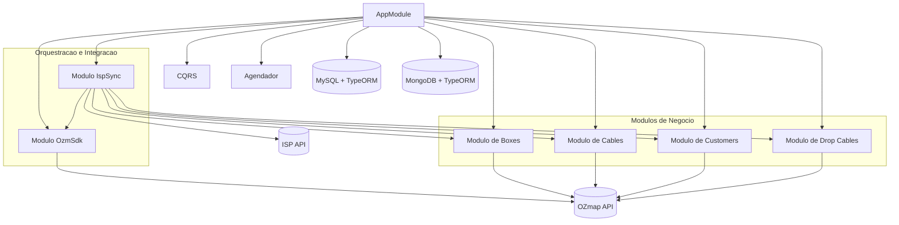

# Arquitetura do Projeto

Este documento descreve a arquitetura atual do **ozmap-mf**.

## Visao Geral do Sistema

O projeto usa arquitetura modular em NestJS, com separacao por camadas (Apresentacao, Aplicacao, Dominio e Infraestrutura), CQRS para comandos e execucao agendada com `@nestjs/schedule`.

### Diagrama 1: Camadas

### Diagrama 2: Modulos e Integracoes

## Fluxo Principal de Sincronizacao

1. `IspSyncCron` dispara `RunIspSyncCommand` a cada **10 segundos**.
2. `RunIspSyncUseCase` consulta ISP API (`boxes`, `cables`, `customers`, `drop_cables`).
3. Cada modulo de dominio executa persistencia/upsert no MySQL.
4. `RunOzmapSyncUseCase` dispara sincronizacao para OZmap em sequencia: `SyncBoxesOzmapCommand` -> `SyncCablesOzmapCommand` -> `SyncCustomersOzmapCommand` -> `SyncDropCablesOzmapCommand`.

## Modulos e Responsabilidades

- `isp-sync`: orquestra a importacao do ISP e aciona o sync OZmap.
- `boxes`: persiste boxes e sincroniza com OZmap.
- `cables`: persiste cabos, relaciona N:N com boxes (`cable_boxes_connected`) e sincroniza com OZmap.
- `customers`: persiste clientes e sincroniza com OZmap.
- `drop-cables`: persiste drop cables e sincroniza com OZmap.
- `ozm-sdk`: encapsula autenticacao/acesso ao SDK da OZmap.
- `failure-handler`: no contexto do teste, a proposta e resolver o problema de retries. Toda vez que uma conversa com a API da OZmap falhar, o erro deve ser gravado no MongoDB (`failure_queue`), e o modulo deve reprocessar as tentativas; ao esgotar o limite, deve mover para `failure_dead_letter`. Esse fluxo foi desenhado, mas nao foi implementado por falta de tempo.

## Persistencia e Relacionamentos

- MySQL (via TypeORM): tabelas principais `boxes`, `cables`, `customers`, `drop_cables`, `cable_boxes_connected`.
- Relacoes de dominio: `Box` 1:N `Customer`, `Box` 1:N `DropCable`, `Customer` 1:N `DropCable`, `Cable` N:N `Box`.
- MongoDB (via TypeORM): colecoes de falhas `failure_queue` e `failure_dead_letter`.

## Observacoes Atuais

- O `AppModule` sobe duas conexoes TypeORM: MySQL (default) e MongoDB (`name: "mongodb"`).
- O fluxo principal atual e orientado a `cron + command bus`; nao ha controllers HTTP expostos no `src`.
- Sincronizacao OZmap ja esta implementada para os quatro dominios: `boxes`, `cables`, `customers` e `drop-cables`.
- O `failure-handler` esta previsto para tratar falhas de integracao com a OZmap API, registrando erros no MongoDB e executando retries de forma centralizada, mas ficou pendente por falta de tempo.
