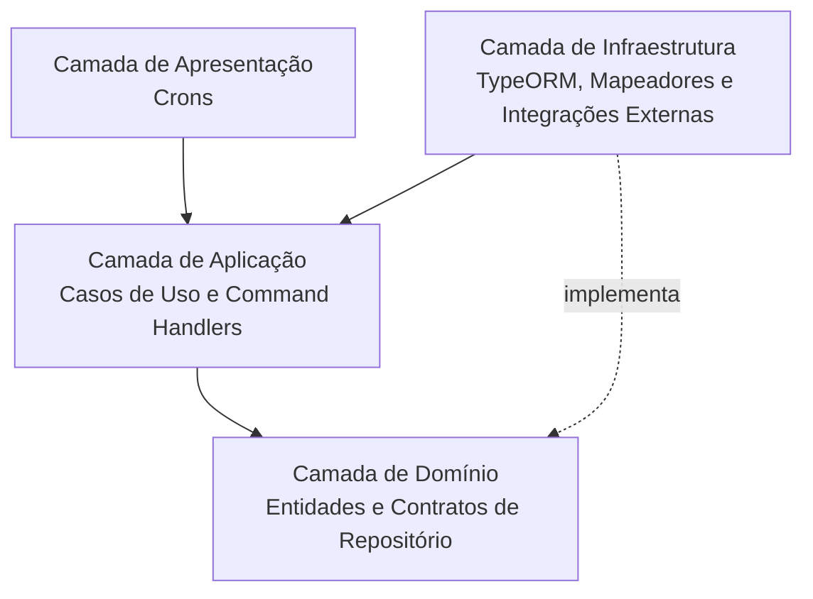

# Arquitetura do Projeto

Este documento descreve a arquitetura atual do **ozmap-mf**.

## Visão Geral do Sistema

O projeto usa arquitetura modular em NestJS, com separação por camadas (Apresentação, Aplicação, Domínio e Infraestrutura), CQRS para comandos e execução agendada com `@nestjs/schedule`.

### Diagrama 1: Camadas

### Diagrama 2: Módulos e Integrações

## Fluxo Principal de Sincronização

1. `IspSyncCron` dispara `RunIspSyncCommand` a cada **10 segundos**.
2. `RunIspSyncUseCase` consulta ISP API (`boxes`, `cables`, `customers`, `drop_cables`).
3. Cada módulo de domínio executa persistência/upsert no MySQL.
4. `RunOzmapSyncUseCase` dispara sincronização para OZmap em sequência: `SyncBoxesOzmapCommand` -> `SyncCablesOzmapCommand` -> `SyncCustomersOzmapCommand` -> `SyncDropCablesOzmapCommand`.

## Módulos e Responsabilidades

- `isp-sync`: orquestra a importação do ISP e aciona o sync OZmap.
- `boxes`: persiste boxes e sincroniza com OZmap.
- `cables`: persiste cabos, relaciona N:N com boxes (`cable_boxes_connected`) e sincroniza com OZmap.
- `customers`: persiste clientes e sincroniza com OZmap.
- `drop-cables`: persiste drop cables e sincroniza com OZmap.
- `ozm-sdk`: encapsula autenticação/acesso ao SDK da OZmap.
- `failure-handler`: no contexto do teste, a proposta é resolver o problema de retries. Toda vez que uma conversa com a API da OZmap falhar, o erro deve ser gravado no MongoDB (`failure_queue`), e o módulo deve reprocessar as tentativas; ao esgotar o limite, deve mover para `failure_dead_letter`. Esse fluxo foi desenhado, mas não foi implementado por falta de tempo.

## Persistência e Relacionamentos

- MySQL (via TypeORM): tabelas principais `boxes`, `cables`, `customers`, `drop_cables`, `cable_boxes_connected`.
- Relações de domínio: `Box` 1:N `Customer`, `Box` 1:N `DropCable`, `Customer` 1:N `DropCable`, `Cable` N:N `Box`.
- MongoDB (via TypeORM): coleções de falhas `failure_queue` e `failure_dead_letter`.

## Observações Atuais

- O `AppModule` sobe duas conexões TypeORM: MySQL (default) e MongoDB (`name: "mongodb"`).
- O fluxo principal atual é orientado a `cron + command bus`; não há controllers HTTP expostos no `src`.
- Sincronização OZmap já está implementada para os quatro domínios: `boxes`, `cables`, `customers` e `drop-cables`.
- O `failure-handler` está previsto para tratar falhas de integração com a OZmap API, registrando erros no MongoDB e executando retries de forma centralizada, mas ficou pendente por falta de tempo.
