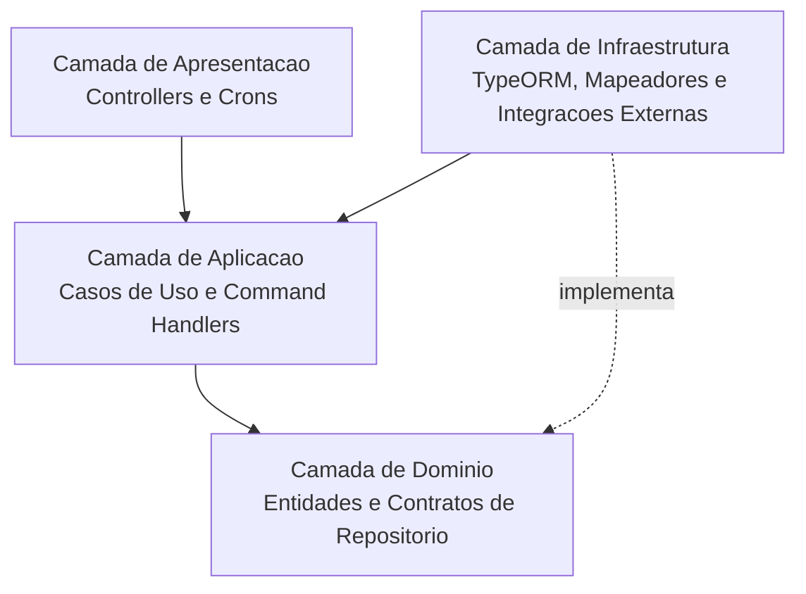
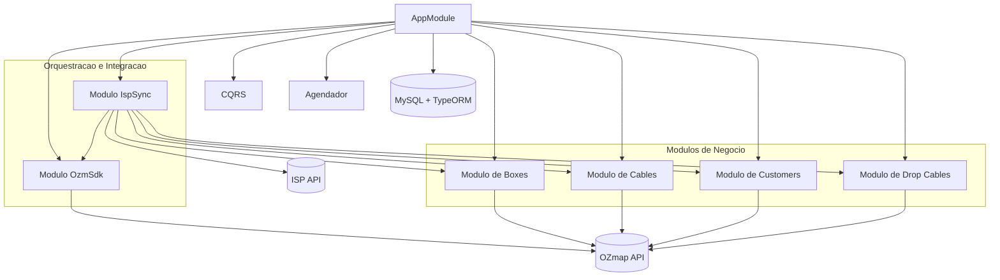

# Arquitetura do Projeto

Este documento descreve a arquitetura atual do **ozmap-mf**.

## Visao Geral do Sistema

O projeto segue uma arquitetura modular no NestJS, com separacao por camadas (Apresentacao, Aplicacao, Dominio e Infraestrutura) e uso de CQRS para comandos.

### Diagrama 1: Camadas

### Diagrama 2: Modulos e Integracoes

## Fluxo Principal de Sincronizacao

1. `IspSyncCron` dispara `RunIspSyncCommand` a cada 30 segundos.
2. `RunIspSyncUseCase` busca dados na API do ISP (`boxes`, `cables`, `customers`, `drop_cables`).
3. Cada modulo executa `upsertMany` no MySQL.
4. Ao final, `RunOzmapSyncUseCase` dispara sincronizacao com OZmap.
5. Arquitetura alvo: **boxes, cables, customers e drop-cables** sincronizados com OZmap com casos de uso dedicados por modulo.

## Modulos e Responsabilidades

- `isp-sync`: orquestra fluxo de importacao ISP e sincronizacao para OZmap.
- `boxes`: persiste boxes e sincroniza boxes com OZmap.
- `cables`: persiste cabos e atualiza relacao N:N com boxes (`cable_boxes_connected`).
- `customers`: persiste clientes.
- `drop-cables`: persiste drop cables.
- `ozm-sdk`: encapsula autenticacao/acesso ao SDK da OZmap.

## Persistencia e Relacionamentos

- Banco principal: **MySQL** via TypeORM.
- Tabelas principais: `boxes`, `cables`, `customers`, `drop_cables`, `cable_boxes_connected`.
- Relacoes:
  - `Box` 1:N `Customer`
  - `Box` 1:N `DropCable`
  - `Customer` 1:N `DropCable`
  - `Cable` N:N `Box`

## Observacoes Atuais

- Existe configuracao de MongoDB no projeto, mas o `AppModule` atual sobe apenas MySQL.
- Os endpoints HTTP atuais sao basicos (`/isp-sync/hello` e `/ozm-sdk/hello`), enquanto o fluxo principal roda por cron/CQRS.
- Implementacao atual da sincronizacao com OZmap: apenas `boxes`.
- Direcao arquitetural: todos os modulos de negocio seguirem o mesmo padrao de integracao com a API OZmap.
